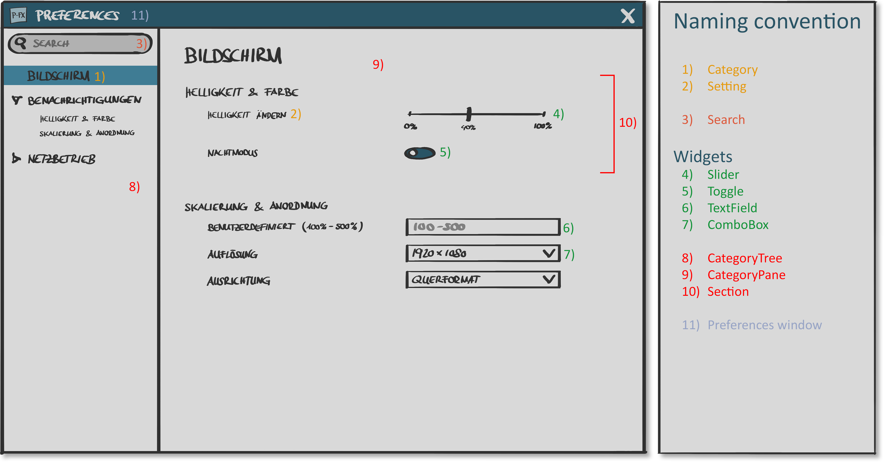

# PreferencesFX
**Preferences dialogs for business applications made easy. Creating preference dialogs in Java has never been this easy!**

## What is PreferencesFX?

Creating preference dialogs in JavaFX is a tedious and very error-prone task. PreferencesFX is a framework which solves this problem. 
It enables the developer to create preferences dialogs with ease and creates well-designed and user-friendly preference dialogs by default. 

## Main Features

- Simple and understandable  API
- The most important Features are shown below in the MVP.png
- We're also referencing to the requirements.adoc. You can create one when launching the gradle task: 'ascidoctor'

 MVP.png

##Team
 
- Marco Sanfratello
  - marco.sanfratello@students.fhnw.ch
  - Skype: sanfratello.m@gmail.com 
  - GitHub: Genron

- François Martin
  - francois.martin@students.fhnw.ch 
  - Skype: francoisamimartin
  - GitHub: martinfrancois
  
- Dirk Lemmermann
  - dlemmermann@gmail.com
  - Skype: dlemmermann
  - GitHub: dlemmermann
  
- Dieter Holz
  - dieter.holz@fhnw.ch
  - Skype: dieter.holz.canoo.com
  - GitHub: DieterHolz

