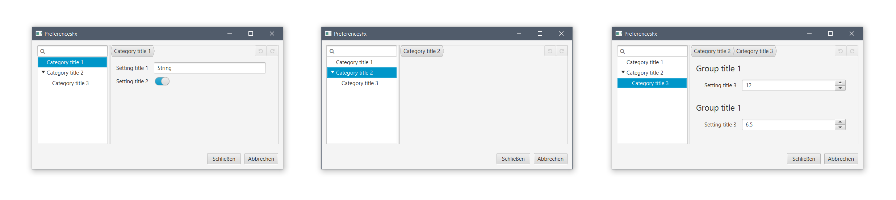
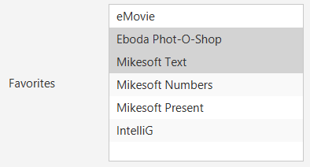

# PreferencesFX
**Preferences dialogs for business applications made easy. Creating preference dialogs in Java has never been this easy!**

## What is PreferencesFX?
Creating preference dialogs in JavaFX is a tedious and very error-prone task. PreferencesFX is a framework which solves this problem. It enables the developer to create preferences dialogs with ease and creates well-designed and user-friendly preference dialogs by default. 

## Main Features
- Simple and understandable  API
- The most important Features are shown in the picture below: The created preferences dialog:

Feature | Description
------ | -----------
`Search / Filter` | Filters all categories after a given String. Helps to find the required category.
`Tree view` | Shows all categories the user defines.
`BreadCrumbBar` | Shows the user the path to the selected category and allows him to navigate back.
`Undo / Redo Buttons` | Allows the user a stepwise undo and redo possibility of his last changes.
`Instant persistance` | Any changes to the application are saved instant.
`Various setting types` | Like: boolean, String, Integer, Double, Lists, Objects

 The created preferences dialog

## Documentation
This project uses the plugin `asciidoctor` to create the necessary documents. To create them you can simply launch the gradle task: `asciidoctor`. Following documents will be created:
- index.adoc
- developer-reference.adoc
- requirements.adoc

## Semantics
PreferencesFX contains different semantic layers. A preferences dialog can contain multiple Categories. Each `Category` can contain multiple Groups and each `Group`can contain multiple `Settings`.

For better illustration, the basic concept of writing a dialog is shown below:
```Java
PreferencesFx preferencesFx = 
    PreferencesFx.of(AppStarter.class,
        Category.of("Category Title",
            Group.of("Group Title",
                Setting.of("Setting Title", new Property())
            )
        )
    );
```

Note: The user can decide to add only `Settings` to a `Category` instead of a `Group`. In this case the API creates automatically a single `Group` and add it to the `Category`. But this works only when only one `Group` is needed.

## Demos
We created several demos to visualize the possibility of the `PreferencesFX API`. To view any of them, one can change the import of the `RootPane.java` class in the `AppStarter.java` class. The class can be found following the path:

`../preferencesfx-demo/src/main/java/com/dlsc/preferencesfx/AppStarter.java`

The user can choose between the following demo types:

Import | Description
------ | -----------
`extended` | Just a full TreeView populated with a lot of categories, groups and settings without any bindings. To show how a full populated TreeView might look like. 
`i18n` | A demo which shows, that the preferences adapt to changing the language.
`oneCategory` | To show the behaviour of the API when only one category is used: No breadcrumbs and no TreeView will be added.
`standard` | The standard demo with a few settings and fully working bindings.

## Defining a preferences dialog
Creating a preferences dialog is as simple as calling `FreferencesFx.of()`.

```Java
StringProperty stringProperty = new SimpleStringProperty("String");
BooleanProperty booleanProperty = new SimpleBooleanProperty(true);
IntegerProperty integerProperty = new SimpleIntegerProperty(12);
DoubleProperty doubleProperty = new SimpleDoubleProperty(6.5);

PreferencesFx preferencesFx = 
    PreferencesFx.of(AppStarter.class, // Save class (to save the preferences)
        Category.of("Category title 1",
            Setting.of("Setting title 1", stringProperty), // Creates automatically one group
            Setting.of("Setting title 2", booleanProperty) // which contains both settings
        ),
        Category.of("Category title 2")
            .subCategories( // Adds another Category as child to the existing one
                Category.of("Category title 3",
                    Group.of("Group title 1",
                        Setting.of("Setting title 3", integerProperty)
                    ),
                    Group.of("Group title 1",
                        Setting.of("Setting title 3", doubleProperty)
                    )
                )
            )
    ).persistApplicationState(true).debugHistoryMode(true);
```

This code snippet results in the following preferences window, containing three categories:

 Result

For creating a setting, the user needs only to hand over a title and a `Property`. `PreferencesFX` does the rest. The user can then listen to this property for when it changes and apply them to his own application.

The preferences have a range of options that define their semantics and change their functionality:

**Must haves**

Method | Description
------ | -----------
`AppStarter.class` | In the constructor of the PreferencesFx a `saveClass` is required. This class is used to save the preferences and is further defined in the javadoc.
`description (category)` | Each `Category` must have a description. This is required for displaying it's description in the `ListView`.
`description (setting)` | Each `Setting` must have a description. If for some reason no description is avaliable one can hand over `null`.

- Information: To store the values of each Setting we used the `Preferences API`. During the usage of the PreferencesFX API it can happen, that the user wants a clear storage space. We created a test method which clears the storage. The method is called `PreferencesStorageReset.java` and is found using the following path:

`../preferencesfx-demo/src/test/java/PreferencesStorageReset.java`

**Optionals**

Method | Class | Description
------ | ----- | -----------
`.subcategories` | `Category` | A way to raise the height of the tree. Subcategories allows a `Category` to have additional categories as Children. Those are also displayed in the tree. 
`.description` | `Group` | If someone decides to not add the description of a group in the constructor, he is able to add it after creation of the group.
`.validate` | `Setting` | Allows to add a validator to a setting.
`.persistApplicationState` | `PreferencesFx` | Defines if the PreferencesAPI should save the applications states. This includes the persistence of the dialog window, as well as each settings values.
`.persistWindowState` | `PreferencesFx` | Defines whether the state of the dialog window should be persisted or not.
`.saveSettings` | `PreferencesFx` | Defines whether the adjusted settings of the application should be saved or not.
`.debugHistoryMode` | `PreferencesFx` | Defines whether the table to debug the undo / redo history should be shown in a dialog when pressing a key combination or not. Pressing Ctrl + Shift + H (Windows) or CMD + Shift + H (Mac) opens a dialog with the undo / redo history, shown in a table.
`.buttonsVisibility` | `PreferencesFx` | Sets the visibility of the decline and close buttons in the `PreferencesDialog`.
`.i18n` | `PreferencesFx` | Sets the translation service property of the preferences dialog. 

The following table shows how to create `Settings` using the current supported Properties and how they look like:

```html
<table>
    <tr>
        <th>Syntax</th>
        <th>Outcome</th>
    </tr>

    <tr>
        <td><pre lang="java">
// Integer
IntegerProperty brightness = new SimpleIntegerProperty(50);
Setting.of("Brightness", brightness);</pre>
        </td>
        <td></td>
    </tr>

    <tr>
        <td><pre lang="java">
// Integer Range
IntegerProperty fontSize = new SimpleIntegerProperty(12);
Setting.of("Font Size", fontSize, 6, 36);</pre>
        </td>
        <td></td>
    </tr>

    <tr>
        <td><pre lang="java">
// Double
DoubleProperty scaling = new SimpleDoubleProperty(1);
Setting.of("Scaling", scaling);</pre>
        </td>
        <td></td>
    </tr>

    <tr>
        <td><pre lang="java">
// Double Range
DoubleProperty lineSpacing = new SimpleDoubleProperty(1.5);
Setting.of("Line Spacing", lineSpacing, 0, 3, 1);</pre>
        </td>
        <td></td>
    </tr>

    <tr>
        <td><pre lang="java">
// Boolean
BooleanProperty nightMode = new SimpleBooleanProperty(true);
Setting.of("Night Mode", nightMode);</pre>
        </td>
        <td></td>
    </tr>

    <tr>
        <td><pre lang="java">
// String
StringProperty welcomeText = new SimpleStringProperty("Hello World");
Setting.of("Welcome Text", welcomeText);</pre>
        </td>
        <td></td>
    </tr>

    <tr>
        <td><pre lang="java">
// Combobox, Single Selection, with ObservableList
ObservableList<String> resolutionItems = FXCollections.observableArrayList(Arrays.asList(
  "1024x768", "1280x1024", "1440x900", "1920x1080")
);
ObjectProperty<String> resolutionSelection = new SimpleObjectProperty<>("1024x768");
Setting.of("Resolution", resolutionItems, resolutionSelection);</pre>
        </td>
        <td></td>
    </tr>

    <tr>
        <td><pre lang="java">
// Combobox, Single Selection, with ListProperty
ListProperty<String> orientationItems = new SimpleListProperty<>(
  FXCollections.observableArrayList(Arrays.asList("Vertical", "Horizontal"))
);
ObjectProperty<String> orientationSelection = new SimpleObjectProperty<>("Vertical");
Setting.of("Orientation", orientationItems, orientationSelection);</pre>
        </td>
        <td></td>
    </tr>

    <tr>
        <td><pre lang="java">
// Combobox, Multi Selection
ListProperty<String> favoritesItems = new SimpleListProperty<>(
  FXCollections.observableArrayList(Arrays.asList(
      "eMovie", "Eboda Phot-O-Shop", "Mikesoft Text",
      "Mikesoft Numbers", "Mikesoft Present", "IntelliG"
      )
  )
);
ListProperty<String> favoritesSelection = new SimpleListProperty<>(
  FXCollections.observableArrayList(Arrays.asList(
      "Eboda Phot-O-Shop", "Mikesoft Text"))
);
Setting.of("Favorites", favoritesItems, favoritesSelection);</pre>
        </td>
        <td></td>
    </tr>

    <tr>
        <td><pre lang="java">
// Custom Control
IntegerProperty customControlProperty = new SimpleIntegerProperty(42);
IntegerField customControl = Field.ofIntegerType(customControlProperty).render(
  new IntegerSliderControl(0, 42));
Setting.of("Favorite Number", customControl, customControlProperty);</pre>
        </td>
        <td></td>
    </tr>
</table>
```

## Rendering a form

The only point of interaction is the `FormRenderer`. It delegates rendering of further components to other renderers.

```java
Pane root = new Pane();
root.getChildren().add(new FormRenderer(form));
```

All fields have a default control that is used for rendering. This can be changed to another compatible implementation using the `render()` method.

```java
Field.ofMultiSelectionType(…)
        .render(new SimpleCheckBoxControl<>())
```

## Localisation
All displayed values are localisable. PreferencesFx accepts keys which are then used for translation. By default, PreferencesFx includes a `ResourceBundle`-based implementation, however, this can be exchanged for a custom implementation. Adding the i18n support is simply done by calling the method `.i18n()` at the end when creating the preferences:

```java
private ResourceBundle rbDE = ResourceBundle.getBundle("demo.demo-locale", new Locale("de", "CH"));
private ResourceBundle rbEN = ResourceBundle.getBundle("demo.demo-locale", new Locale("en", "UK"));

private ResourceBundleService rbs = new ResourceBundleService(rbEN);

PreferencesFx.of(…)
        .i18n(rbs);
```

## Validation
It is possible for all settings to add a validator. PreferencesFX offers a wide range of pre-defined validators, but also includes support for custom validators using the `CustomValidator.forPredicate()` method. This part of the implementation was took from the former project `FormsFX`. The following table lists the supported validators:

| Validator | Description |
| --------- | ----------- |
| `CustomValidator` | Define a predicate that returns whether the field is valid or not. |
| `DoubleRangeValidator` | Define a number range which is considered valid. This range can be limited in either one direction or in both directions. |
| `IntegerRangeValidator` | Define a number range which is considered valid. This range can be limited in either one direction or in both directions. |
| `RegexValidator` | Valiate text against a regular expression. This validator offers pre-defined expressions for common use cases, such as email addresses.
| `SelectionLengthValidator` | Define a length interval which is considered valid. This range can be limited in either one direction or in both directions. |
| `StringLengthValidator` | Define a length interval which is considered valid. This range can be limited in either one direction or in both directions. |

## Advantages
- Less error-prone
- Less code needed
- Easy to learn
- Easy to understand
- Easy to extend

##Team
- Marco Sanfratello
  - marco.sanfratello@students.fhnw.ch
  - Skype: sanfratello.m@gmail.com 
  - GitHub: Genron

- François Martin
  - francois.martin@students.fhnw.ch 
  - Skype: francoisamimartin
  - GitHub: martinfrancois
  
- Dirk Lemmermann
  - dlemmermann@gmail.com
  - Skype: dlemmermann
  - GitHub: dlemmermann
  
- Dieter Holz
  - dieter.holz@fhnw.ch
  - Skype: dieter.holz.canoo.com
  - GitHub: DieterHolz
