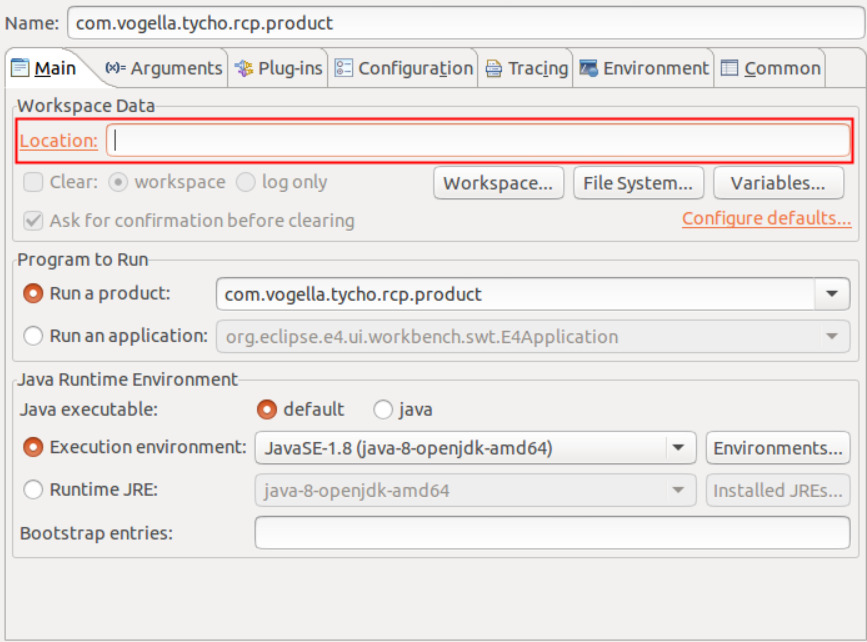
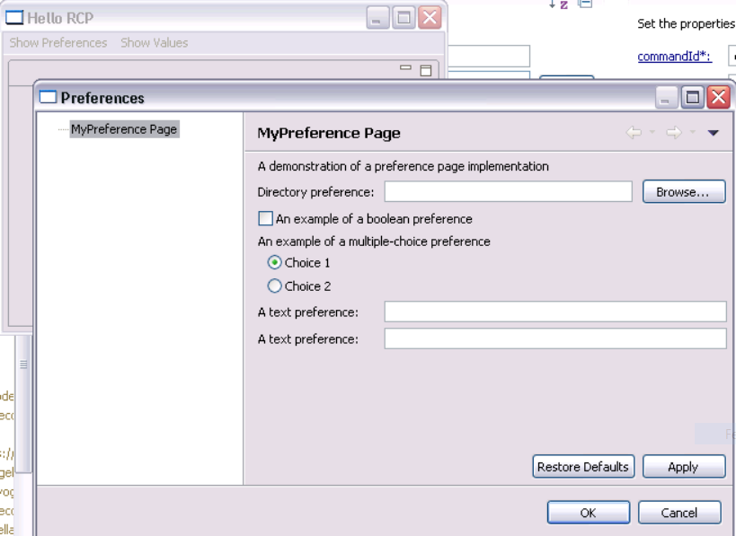
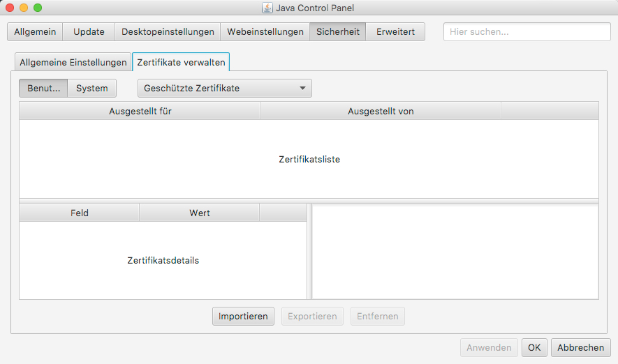
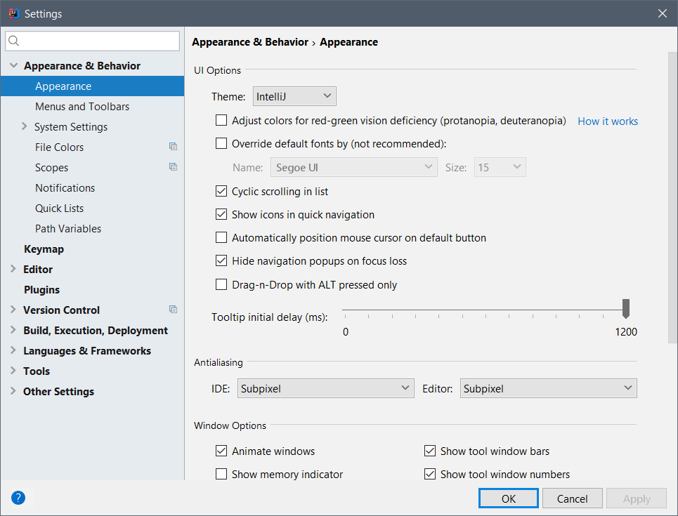
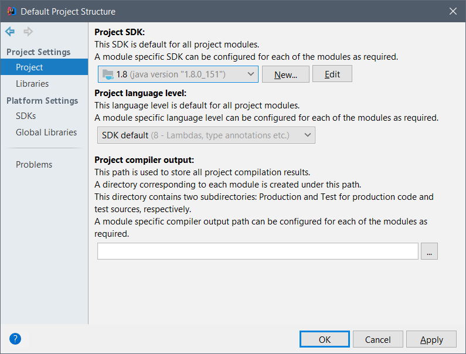
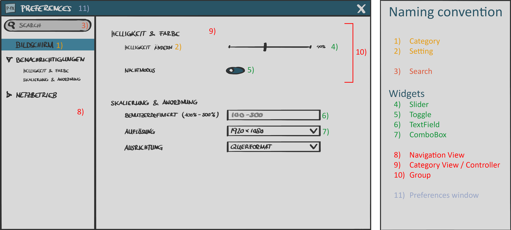
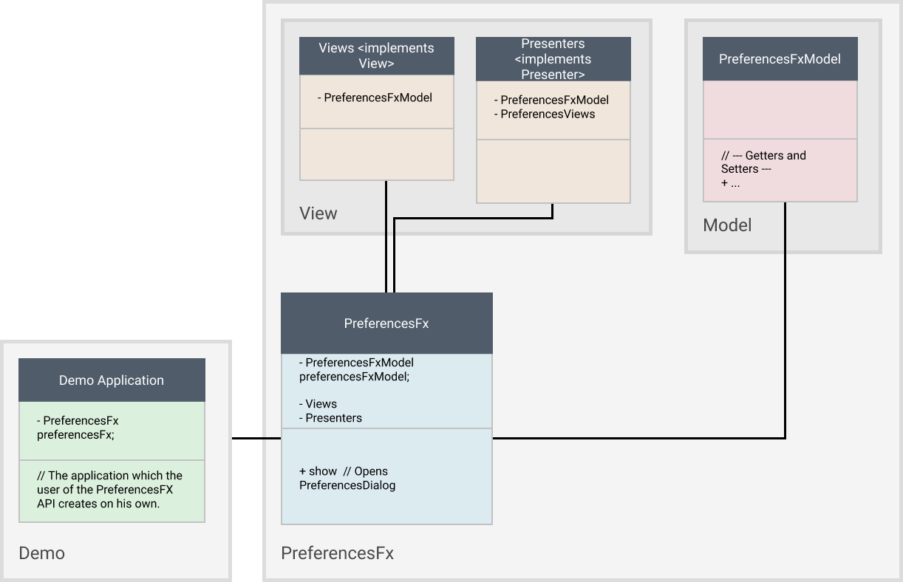

= PreferencesFX
François Martin; Marco Sanfratello

//Table of contents
:toc:
// Path to the code references
:sourcedir: ../src/main/java
:sourcedirdemo: ../preferencesfx-demo/src/main/java

== Abstract / Management summary

----- ToDo -----

== Introduction
The PreferenesFX API creates a preferences window. This is done by simply writing a title and giving it a property and all the other work is done by the API itself. Often developers have no time, energy or simply not mind to write a preferences window for their application. It’s a generic, boring work which nobody really wants to do. The picture below shows the final result of the PreferencesFX API in use.

image::images/preferencesFX_in_use.png[PreferencesFX in use]

The idea of the PreferencesFX API is to replace this boring work with a much simpler, cleaner solution. Always in mind to relieve this part of a developers work as much as possible, this solution was created.

The PreferencesFX API works with a fluent API approach (for further information ). The developer can build up his preferences window by simply calling function after function to define it further. Each preference which needs to be stored represents a setting. One or multiple settings are collected in a group. One or multiple groups are collected in a category and the preferences window consists of one or multiple categories.

The project itself is programmed with a model view presenter structure, which separates the frontend and backend to ensure a clear overview.

In the following chapters, the reader will gain additional insights of the projects structure and the features the PreferencesFX API provides.

== Definitions
The following chapter explains several important definitions which are mentionned in this document.

=== Fluent API
The user of the `PreferencesFX API` builds his preferences dialog using the so called fluent API. This means, that the structure of creating was implemented the way, that one could (theoretically) write the whole dialog in one line. This is done by using methods, which are returning the same object on which the method is called.

A famous example of the fluent API in use are streams. Our customer wanted us to apply it the same way in the `PreferencesFX API`. The code snippet below, which is used in `RootPane.java`, shows how the preferences are set up and the fluent API is used:

[source,java]
----
include::{sourcedirdemo}/com/dlsc/preferencesfx/standard/RootPane.java[tags=setupPreferences]
----

The whole code snippet uses the fluent API, but to explain it the best let's have a look at the last line of code. There are several methods called.

One can see in the code snippet below, that the method returns exactly the object on which this method was called. This style of implementation allows the user of the API a simple, intuitive and easy way to create the preferences. This method is being used in `PreferencesFx.java`:

[source,java]
----
include::{sourcedir}/com/dlsc/preferencesfx/PreferencesFx.java[tags=fluentApiMethod]
----

== The way to PreferencesFX
=== Briefing
Our customer is Dirk Lemmermann, CEO of Dirk Lemmermann - Software and Consulting (http://dlsc.com/[dlsc.com]). One of his former projects was the FormsFX API, where a developer can easily create forms without a lot of effort. FormsFX uses the fluent API approach to create its forms. His approach was to adapt this idea of an easy way to create a structure with a predefined User Interface to preference windows. The developer should not need to invest a lot of time creating a preferences window. We got access to a fork of FormsFX. Our customer allowed us to use it for creation of our project.

Regarding the visual appearance we should orientate ourselves at the preferences window of the programming platform IntelliJ IDEA regarding the look and feel.

=== First thoughts
Well, we didn't just started programming. In fact we did some research. Although our customer had initial some ideas, we did not just accept and implement these. In the following chapters we're going to discuss our initial steps and thoughts on how to set up our project.

==== Persona
This applied together with the search after the perfect layout. We asked ourselfs: What would be the target group? Well of course everyone which would ever use an application which uses the `PreferencesFX API`. But this was not really a strict persona. Because this could be literally anyone.

Another thought was, that we did not really have influence of the final application, the developer decides to create. If he decides for example to create three different preferences windows it's not really our fault that the application has a bad usability. Of course we need to do our best to give a developer no reasons to do such things, but in general we don't really can change something.

Or what about different types of applications? For example an application for financiers would look different than one for carpenters.

In conclusion we discovered, that our primary persona was not the end user of an application, but we realized, that the developer of the application was our persona. Why? Well of course we would consider the layout of the preference dialog as important, but the developer of the application should be able to create a preferences window as fast and as simple as possible.

==== Layout
As stated before, the layout of the preferences dialog was considered as important.
 For that reason we looked at various preferences windows and noted the usual best practices and the do's and dont's which are made through the last years.

===== Eclipse RCP
More a list of dont's than do's provides the analysis of the `Eclipse RCP API`.
 Below there are two different screenshots of the rcp in use.

[cols="1,1"]
.Eclipse RCP
|===
| Eclipse RCP, window 1|  Eclipse RCP, window 2
|===

Especially displeasing are the huge amount of borders which are used to separate the settings from each other.
 Interesting is the fact, that even with borders the whole dialog appears big and confusing.
 We wanted to work as less as much with borders.
 Instead we would use the "gestalt principles" to suggest togetherness of settings.

At the top of the picture `Eclipse RCP, window 1`, there is a TextField positioned with the description "Name".
 We had no idea what this was for.
 As a lesson learned we kept, that above any navigation one should not be able to change any settings.
 This corrupts the workflow.

Everywhere are settings and buttons and no one really knows what's going on.
 One big lesson learned was, that we would clearly separate the "selection and filtering options" and the "changing the preferences options".
 We would also keep any buttons away, because in a preferences window no one should need a button to open another window where he can change another settings.

===== MacOS
It was joyful to see how simple and clean the `macOS` constructs its preferences windows.
 This was really a contrast to the overwhelming preferences window of the `Eclipse RCP API`.
 The two pictures below are showing one internal preferences window and an external preferences window.
 The external one belongs to a installed program and was not default installed in the operation system.

[cols="1,1"]
.MacOS
|===
|image:images/alternatives/ios_internal.jpg[internal] Internal macOS application | External macOS application
|===

An interesting aspect which those preferences windows apply are the tabs which separate the content.
 This was also something we planned to apply in our project.
 The original idea was using TabViews to visualize the categories.
 When the amount of categories would exceed a certain number, the API should switch automatically from tab view to a tree view for visualization.

===== IntelliJ
IntelliJ is one of the good examples, which does pretty much right.

[cols="1,1"]
.IntelliJ
|===
| Standard IntelliJ dialog |  Undo/Redo buttons
|===

A lot of our design was adapted from this view.
Only the fact, that some windows are structured different displeased us.
For example in the "Standard IntelliJ dialog" there is a search field and a breadcrumb, whereas in the second screenshot are those not, but an undo/redo function.

Speaking of it: The undo/redo function applies only to the navigation through the categories and not to the changed value of the settings.
From our point of view, this made absolutely no sense.
That a user of the dialog can navigate back in the navigation but not the changed settings makes not much sense.
We decided, that we would implement an undo/redo function but it should only affect the changed setting values and not the actual navigation.

===== Minimal viable product
As a result of our research we created a paper prototype, which was also the minimal viable product (MVP), our promise to our customer, that he gets at least this product from us.
 The MVP is shown in the picture below:

==== The way creating the preferences
We also did some research about how would a developer use the PreferencesFX API.
 When someone usually uses any JavaFX components, for example a `MenuBar`, he writes in the following code style:

[source,java]
----
MenuBar menuBar = new MenuBar();
Menu menu = new Menu("Menu");
MenuItem menuItem = new MenuItem("Menu Item");

menu.getItems().add(menuItem);
menuBar.getMenus().add(menu);
----

According to this code style we wrote first pseudo code snippets to try using the PreferencesFX API in this style:

[source,java]
----
PreferencesFx preferencesFx = new PreferencesFx();
Category category = new Category("Category");
Group group = new Group("Group");
Setting setting = new Setting("Setting", new SimpleBooleanProperty(true));

group.getSettings().add(setting);
category.getGroups().add(group);
preferencesFx.getCategories().add(category);
----

The second try was with the fluent API approach, like our customer suggested:

[source,java]
----
PreferencesFx preferencesFx = PreferencesFx.of(
    Category.of("Category",
        Group.of("Group",
            Setting.of("Setting", new SimpleBooleanProperty(true))
        )
    )
);
----

The reason why we finally were convinced that the fluent API approach was the right way, was how intuitive it was to write the code and how clearly arranged the code was.
 That way everyone sees what is a setting and what is a category.
 Especially when an application has literally hundreds of preferences which are needed to store.

==== Using FormsFX or not
Another question we asked ourselves was if we should use the former project FormsFX or not.
 We had serious concerns if the projects had bugs we had to deal with in the future.
 Another concern was, that we needed to get to know the project.

On the other hand we would save a huge amount of time.
All the widgets were created, the bindings were there and the style sheets were already programmed.

The question was, if the time we'd need to invest to overcome all of this concerns would match the time we'd save when using the project.
 For example we could use the base structure and all of the widgets which were already programmed in the project.

At last we decided to take the risk and use the FormsFX project, fully aware that it might has some bugs we have to deal with.
But we didn't have to write everything bottom up and thought that we'd save a lot of time.

In conclusion we really saved a lot of time using `FormsFX` as a base, although we had several bugs.

==== Started programming
We don't wanted to spend any more time researching. So we just started programming and tried to write as fast as possible some code down to have something to work on. This helped a lot to early have some satisfying experiences in the project and keep us motivated.

=== Challenges
During our project we faced several challenges, which we needed to overcome. In the following chapters we'll have a look at the most important ones.

==== Instant persistence
We discovered that preferences windows often provide the user a lot of buttons, like close, discard, apply and more.
 All of this buttons have their reasons.
 But in general the huge amount of buttons disturbed us.
 For that reason we decided to build the API the way, that changes in the preferences are applied instant.
 This way we got rid of the buttons.

In case a developer still wants to have buttons, the API provides the method `setButtonsVisible()` which allows him to define the visibility of the buttons.
 There are two button types available: `Close` and `Cancel`.
 The close button just closes the window and leaves the preferences as they are.
 The cancel button discards all changes which are made during the time the dialog was last opened.

The instant persistence brought up a new problem:
 What shall the application do, when a user wants to revert his last change?
 For this case we came up with an implementation of `undo/redo buttons`.
 This way a user can return all of his changes back to his first one.

==== Issues with FormsFX
As already mentioned, we had some challenges using `FormsFX`. In the following three chapters we're discussing our most interesting challenges.

===== GridPane
The original FormsFX implementation renders a Form by using one GridPane per Setting, instead of using a GridPane per Form.
This resulted in a few issues.
For example, when scaling down the window horizontally, the description text of the setting quickly shrunk to an unreadable size, while the field next to it was way larger than necessary.
While this isn't an issue on larger screens, it is an issue on smaller screens for sure.

Additionally, when we looked at how the layout looked like with a lot of settings in a category, we noticed that we needed to implement a ScrollPane.
When we implemented the ScrollPane, the resizing issues with the fields started to get even worse.
The fields grew outside of the ScrollPane and the descriptions still shrunk very quickly.
While there is an option in FormsFX to set the `span()` of a `Field`, the problem is that this only applies to the total size of a `Field`.
This means that it isn't possible to change the span of the title and the control itself separately.
The span for the `title` is fixed individually on a per-control basis in the source code to `2`.
The span of the control is then calculated by FormsFX depending on the specified `span()`.

When we presented this issue to Dirk and Dieter, they were not aware of this and agreed that it can't stay that way.
We decided to implement our own renderer, which only uses one GridPane per Form.
Additionally, we moved the logic, which decides about the layout of controls to the renderer.
This also meant, that we needed to pull in all controls from FormsFX and change them accordingly, by removing layout logic.

This was quite a lot of work, but it did pay off in the end.
The resizing is now much more predictable and the layout is much cleaner.

While it paid off, it also meant that we had to change the way settings and groups are selected during the searches.
Previously, we assigned a style class to a marked setting as a whole, since each setting was rendered by FormsFX in its own GridPane.
Using only one GridPane for the whole Form meant, that the title and the control were no longer one unit, but separated in two separate columns.
Applying a style class to both elements individually didn't result in a satisfying result, because the gap inbetween of the columns not being styled.

Researching online resulted in many people having similar issues, with no real solution in sight.
*Our solution* was to only apply the style class to the description and then apply negative insets values for `-fx-background-insets`, which extended over the gap and marked the whole setting.

===== Bidirectional binding
Another bug occured when we were implementing the support of the setting type `ListViewControl`. For some reason the alredy

===== Design for inheritance
Problem with package private and private

==== Möglichst korrekt
einerseits gut, vorwärts, andererseits problem mit refactoring

==== Code refactoring
Architektur

==== StorageHandler
Problems, herausforderungen

==== Undo/Redo
While Java Swing/AWT provides an implementation of undo / redo, by using the https://docs.oracle.com/javase/8/docs/api/javax/swing/undo/UndoManager.html[UndoManager], JavaFX doesn't.

There is a library called https://github.com/FXMisc/UndoFX[UndoFX by Tomas Mikula], which implements this feature.
However, it uses https://github.com/TomasMikula/ReactFX[ReactFX, also by Tomas Mikula], which is a pretty heavyweight library and would add a lot of dependencies, which we want to avoid.
The main reason for us not to use it, however, is the fact that it works by using so called `EventStreams`, a concept introduced by https://github.com/TomasMikula/ReactFX[ReactFX].
While they are great in theory, they prove difficult to use in practice.
Also, https://github.com/FXMisc/UndoFX[UndoFX] requires quite a lot of overhead to implement.

This is why we decided to do our own implementation.
The most relevant classes for this are `History.java` and `Change.java`, found in the `history` package.
A `Change` is based on the idea of listening for changes in the used properties and then creating a `Change` object with the old and the new value of the property.
The `History` class manages a list of changes and handles undo and redo.

If the last change should be undone, the last change in the list will be fetched and the old value of the change will be applied to the respective property.
If the change should be redone, simply apply the new value of the change to the property.

More details on the implementation can be found in the Javadoc of `History.java` and `Change.java`.

==== Search
Do you remember having thought, that a feature would be quite straight forward to implement, later turning out to be very complex and time consuming?
Probably, there hasn't ever been a developer, who doesn't know this situation.

We have never implemented a search for a TreeView before. +
We thought it was just like using a TableView, where you can filter quite easily. +
We have never been more wrong.

`TreeViews` use `TreeItems`, which are organized in a recursive structure (which makes sense, given its hierarchy).
But it seems like `TreeViews` weren't designed with filtering them in mind.
Because of the recursive structure, filtering is quite difficult to do, which requires to use unusual 'hacks' to get it done properly.
At first, we tried to implement it ourselves, but we didn't suceed in a working implementation, which is why we resorted to using a library for it.
Christoph Keimel contributed an implementation of a http://www.kware.net/?p=204[FilterableTreeItem] class to the https://www.eclipse.org/efxclipse/index.html[e(fx)clipse project].
When we figured out how to use it, it turned out to work very well.

Now that the `TreeView` can be filtered for search terms, a second challenge appeared.
Filtering the categories in the `TreeView` is useful, but not very convenient, since the user still has to click through the categories and look through the matches.
For that reason, we implemented an "algorithm" that would automatically switch between different categories, to match what the user was really searching for as good as possible.
This turned out to be difficult, because we had to ask ourselves at first, how intuitive behavior of a search would feel like.
Then we had to quantify it and finally implement it, which was no easy task as well.
We described everything in meticulous detail in the <<developer-reference.adoc#,Developer Reference>>.

=== Architecture
Initially we started programming our project in the way that the model and the view are separated from each other.
But during the project we realized, that the classes would become too big to keep them in this architectural style.
Especially the views were growing more and more.
So we decided that a new architecture should be used to ensure a good overview.

We decided to implement our project in the model view presenter architecture.
 This means that the model and the views are separated from each other.
 All parts have a small cohesion and are able to be replaced easily.
 This has the major advantage that the views can easily be exchanged.
 For example if someone wants in the future a new layout, he can do this relatively easy.
 To make sure that the possibly new view parts are fitting in the project structure, they need to fulfill certain characteristics.
 This is guaranteed by implementing interfaces.
 For this reason we created the two interfaces `View` and `Presenter`.
 The picture below illustrates a simplified version of our project structure.

Here is clearly shown, that the user only creates one instance of the `PreferencesFx` and saves it in his application.
 This is done in the package `Demo`.

In the Package `PreferencesFx` there is the class `PreferencesFx` which is called, when the preferences are created.
 In the constructor of the class is the `PreferencesModel` created.
 Afterwards, all views and their constructors are created, which are needed to visualize the preferences dialog.
 Simply said is the PreferencesFx class used as a controller to manage the frontend and the backend.

The views and the presenters are built the way, that the views only contain visual elements and the presenters regulate the logical parts, like listeners or complex functions, ect.
 This has the immense advantage of having a clear overview.

After creating the preferences one can simply call the method `show()` and the `PreferencesFx` opens a `PreferencesDialog`.
 This dialog contains the `PreferencesView` which puts all other views together.

Another huge advantage of this architectural style is the good testability.
This way the several classes can easily be mocked and therefore tests can be made in isolation.
For example:
In the code snippet below one can see, that all of this classes can easily be mocked and the class `PreferencesFxModel` can be tested in isolation.

[source,java]
----
include::{sourcedir}/com/dlsc/preferencesfx/PreferencesFx.java[tags=testMock]
----

==== CategoryController
The `CategoryController` is the only class in the views package which oesn't follow exactly the defined architecture.
It manages the CategoryViews and the CategoryPresenters and is responsible for exchanging a view if the selected category changes.
The controller is needed because we have a lot of CategoryViews and CategoryPresenters.
To store all of this classes we would need two separate Lists and therefore following exactly the model view presenter architecture would've become very confusing.

Another advantage is flexibility.
Through the controller it is possible to extend the project further in the future.
For example one can easily add an animation when another category is selected and make a smooth transition.

=== Testing
To be honest we wrote not much tests.
The tests are located in the folder `src/test/java/com/dlsc/preferencesfx`.

But in GUI projects are anyways not many tests written.
In fact we did ad hoc tests and tested the functionality of our GUI.
All the visual tests are located in the `docs` subdirectory.

Additionally we used the `Checkstyle` plugin to check our code after syntactic faults.

== Lessons learned
* We just started programming and considered the architecture to late.
We should've started earlier separating the frontend from the backend.
This had the disadvantage, that we needed to invest a lot of time to separate it at the end of the project.
For the next project we are going to focus more on the system architecture in first place.

* We found a bug in FormsFX and fixed it.
But the time it took was too much. Of course our customer is happy, that the bug is solved, but in an industrial project we mustn't do this
 This is not our problem.
 It's the one of the FormsFX team.
 Next time we will discuss the situation with our customer and ask him about his opinion.

* Using the `Asciidoctor` was a really good decision.
It allowed us easily to reference code snippets from our project and it provides a pre formatted layout.

* As always:
Documentation and reports should be written much earlier and continuously during the project.
At least the `Javadoc` should've been written frequent.
For the next project no branch will be merged until all checkstyle errors are eliminated.

== Honesty Declaration
It is hereby declared that the contents of this report, unless otherwise stated, have been authored by François Martin and Marco Sanfratello.
All external sources have been named and quoted material has been attributed appropriately.

Windisch, January 19 2018